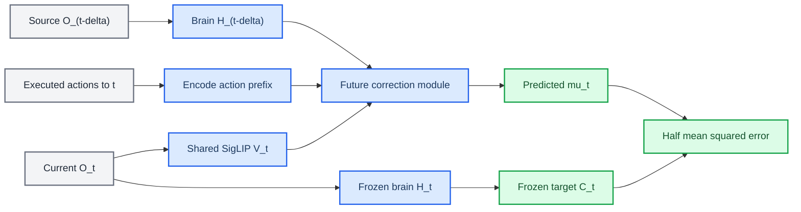
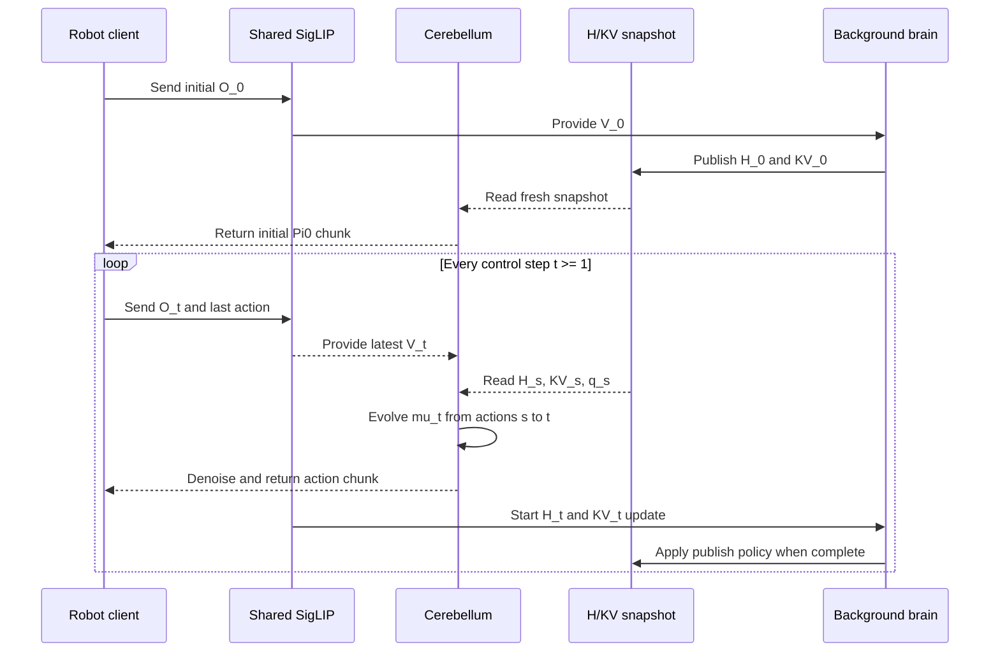

# Jetson-PI-ViT

_华南理工大学研究分支：面向“最新视觉条件 + 大小脑异步推理”的机器人 VLA 实验平台_

[](https://www.scut.edu.cn/)
[](#-当前状态)
[](https://github.com/PKU-SEC-Lab/Jetson-PI)
[](LICENSE)

> **项目归属说明：** 本仓库由华南理工大学研究人员维护，是基于上游
> [Jetson-PI](https://github.com/PKU-SEC-Lab/Jetson-PI) 的研究分支，并非
> Jetson-PI 官方仓库。Jetson-PI 论文、原始方法、模型与实验结果归原作者所有；
> 本分支只对新增的最新视觉条件、训练逻辑和异步推理系统负责。

本项目研究一个直接的问题：既然小脑侧的视觉编码和未来纠正模块比完整大脑推理更轻量，能否让小脑在每个控制步读取最新图像，使用最近可用的 `H/KV` 大脑快照及时生成动作，同时由大脑在后台持续更新快照？

当前主线使用 `linear_joint` 最新视觉条件。它把已执行动作、本体状态、时间间隔和最新 SigLIP 视觉表示联合编码，用于预测当前时刻的去噪条件 `mu`。当前实现不依赖置信度门控；旧的自适应 `kappa`/multi-rollout 路径仍保留用于兼容和对照，但不属于每步小脑主流程。

## 📋 项目重点

相对上游 Jetson-PI，本分支的主要改动如下：

| 方向 | 当前实现 |
| --- | --- |
| 最新视觉条件 | 共享 Pi0 中的 SigLIP，每个控制步只编码一次当前观测图像 |
| 条件融合 | `linear_joint([m, p, e, v_latest])` 联合产生内容偏置和 FiLM 参数 |
| 训练对齐 | `H_(t-delta)`、已执行动作和 `O_t` 共同预测当前压缩特征 `C_t` |
| 异步大脑 | 后台从当前视觉继续计算新的 `H_t/KV_t`，完成后原子发布快照 |
| 每步小脑 | 每执行一个控制步触发一次小脑请求，不等待正在运行的大脑更新 |
| KV 复用 | 小脑使用与 `H_s` 同源的 `KV_s` 去噪，避免混用不同快照 |
| 动作交接 | 支持 `tail_append` 与 `replace_after_one_step` 两种实验模式 |
| 当前主配置 | `Pi0.5 + LIBERO-spatial + H=10 + K=1 + linear_joint` |

更详细的设计与训练定义见：

- [`docs/2026-08-20-latest-visual-global-condition-design.md`](docs/2026-08-20-latest-visual-global-condition-design.md)
- [`docs/2026-08-20-latest-visual-joint-condition-design.md`](docs/2026-08-20-latest-visual-joint-condition-design.md)
- [`docs/2026-08-21-latest-visual-linear-joint-training-logic.md`](docs/2026-08-21-latest-visual-linear-joint-training-logic.md)

## 🧠 方法概览

### 训练时间对齐

定义机器人动力学时间关系：

```text
O_k --a_k--> O_(k+1)
```

对当前时刻 `t` 随机采样 `delta >= 1`，训练样本使用：

```text
源观测：      O_(t-delta)
旧大脑特征：  H_(t-delta)
源本体状态：  q_(t-delta)
已执行动作：  [a_(t-delta), ..., a_(t-1)]
最新视觉：    V_t = SigLIP(O_t.images)
监督目标：    C_t = TokenReducer(H_t)
```

未来纠正模块学习：

```text
WM(H_(t-delta), q_(t-delta), actions[t-delta:t], delta, V_t)
    -> mu_t ~= C_t
```

动作前缀长度严格等于 `delta`，不包含 `a_t`，因为 `a_t` 会把 `O_t` 推进到 `O_(t+1)`。



### `linear_joint` 条件

非视觉条件和最新视觉首先分别编码：

```text
m = ActionEncoder(executed_actions, prefix_mask)
p = ProprioEncoder(q_source)
e = TimeEncoder(delta)
v = VisualPooling(SigLIP(O_t.images), visual_mask)
```

然后联合生成演化条件：

```text
g_joint = concat([m, p, e, v])
u        = joint_u_proj(g_joint)
film     = joint_film_proj(g_joint)
mu       = FutureTokenBlocks(C_source, u, film)
```

最新图像只通过未来纠正模块影响 `mu`。去噪阶段继续使用与旧大脑特征同源的缓存 `KV`，不会把最新图像再次作为新的大脑前缀输入。

### 每步异步推理

初始请求同步产生 `H_0/KV_0` 和第一块正常 Pi0 动作。之后每个控制步共享一次当前 SigLIP 视觉编码：小脑立即读取最近已经完成的快照，后台大脑同时尝试从同一视觉输入更新下一份快照。



服务端会记录从快照源步 `s` 到当前控制步 `t` 之间真正执行的动作，并构造固定长度前缀：

```text
action_prefix = [a_s, ..., a_(t-1)]
delta_steps   = t - s
```

`H_s`、`KV_s`、`q_s` 必须来自同一快照。若后台大脑尚未完成，小脑继续使用旧快照，但视觉仍更新为当前 `O_t`。

### 动作交接模式

| 模式 | 行为 | 用途 |
| --- | --- | --- |
| `tail_append` | 保留旧动作 buffer，仅追加新动作块最后一步 | 对齐 Jetson-PI 尾部补充基线 |
| `replace_after_one_step` | 假设推理期间执行一步；清空旧 buffer，丢弃新块第 0 步，从第 1 步接管 | 更及时地让新视觉动作生效 |

两种模式都属于实验选项。当前 `replace_after_one_step` 固定假设小脑请求耗时一个控制步，尚未根据实测延迟动态裁剪动作。

## 🔧 环境安装

### 运行要求

| 项目 | 建议 |
| --- | --- |
| 操作系统 | Ubuntu 22.04 |
| Python | 3.11 |
| 训练框架 | JAX / Flax NNX |
| GPU | 训练默认 `batch_size=16`，建议至少 48 GB 显存；显存不足时减小 batch |
| 仿真 | LIBERO |

### 克隆与安装

```bash
git clone --recurse-submodules <this-repo-url>
cd Jetson-PI-Vit
git submodule update --init --recursive

export PYTHONNOUSERSITE=1
GIT_LFS_SKIP_SMUDGE=1 uv sync
GIT_LFS_SKIP_SMUDGE=1 uv pip install -e .
```

Pi0.5 的 PyTorch/JAX 兼容补丁沿用上游安装方式：

```bash
cp -r ./src/openpi/models_pytorch/transformers_replace/* \
  .venv/lib/python3.11/site-packages/transformers/
```

LIBERO 客户端使用独立环境：

```bash
uv venv --python 3.11 examples/libero/.venv
source examples/libero/.venv/bin/activate
uv pip sync examples/libero/requirements.txt third_party/libero/requirements.txt \
  --extra-index-url https://download.pytorch.org/whl/cu121 \
  --index-strategy=unsafe-best-match
uv pip install -e packages/openpi-client
uv pip install -e third_party/libero
```

### 基础 checkpoint

训练需要 Pi0.5-LIBERO 和上游 future correction module 作为基础权重。上游模型可从 [ModelScope](https://www.modelscope.cn/models/zebinyang/Jetson-PI-pi05) 或 [Hugging Face](https://huggingface.co/diantoudefengshan/Jetson-PI-pi05) 获取。

```bash
pip install modelscope
python -c "from modelscope import snapshot_download; snapshot_download('zebinyang/Jetson-PI-pi05', local_dir='./checkpoints/Pretrained')"
```

基础目录应分别包含：

```text
checkpoints/Pretrained/
├── pi05_libero/
│   └── params/
└── future_correction_module/
    └── params/
```

不要合并两个 `params/` 目录。

## 🧪 训练

当前主实验只执行 Stage 2 条件均值训练：

```text
Stage 1 = 0
Stage 2 = 15000
Stage 3 = 0
Stage 4 = 0
visual_condition_kind = linear_joint
```

当前损失把 `log_var` 固定为零后复用高斯 NLL 实现，等价于 `0.5 * mean((target - mu)^2)`。`logvar_head` 不参与优化。

### 训练参数范围

| 类型 | 模块 |
| --- | --- |
| 训练 | ActionEncoder、ProprioEncoder、TimeEncoder、视觉 pooling、`LinearJointCondition`、FutureTokenBlocks、MeanHead |
| 冻结 | Pi0、共享 SigLIP、PaliGemma LLM、Action Expert、TokenReducer、LogVarHead |
| 排除 | linear-joint 不调用的旧 `u_proj/film` 和 residual 专用投影 |

当前实现会从基础 WM checkpoint 加载形状兼容的既有参数，但不会执行旧 `u_proj/film` 到新 `LinearJointCondition` 的 legacy warm start；新增联合层按当前模型初始化器初始化并通过 Stage 2 训练。

### 启动训练

```bash
cd /path/to/Jetson-PI-Vit

export PATH="$HOME/.local/bin:$PATH"
export PI0_CHECKPOINT=/path/to/checkpoints/Pretrained/pi05_libero
export WM_INIT_FROM_CHECKPOINT=/path/to/checkpoints/Pretrained/future_correction_module
export OPENPI_LIBERO_LOCAL_DATASET_DIR=/path/to/datasets/libero
export PY=/path/to/Jetson-PI-Vit/.venv/bin/python

export STAGE1_STEPS=0
export STAGE2_STEPS=15000
export STAGE3_STEPS=0
export BATCH_SIZE=16
export SAVE_INTERVAL=500
export CUDA_VISIBLE_DEVICES=0

bash scripts/train_wm_libero_spatial_four_stage.sh
```

输出位置：

```text
logs/<EXP_NAME>.log
checkpoints/<EXP_NAME>/world_model_step_<N>/params/
```

训练脚本当前固定 `libero_task_index_min=30`、`libero_task_index_max=40`，对应 LIBERO-spatial 数据范围。修改任务范围时，训练和评估必须保持一致。

## 📊 评估

### 每步小脑主实验

评估时模型结构参数必须与训练 checkpoint 完全一致，尤其是 `linear_joint`、head 数量、GRU 隐藏维度和层数。

```bash
cd /path/to/Jetson-PI-Vit

export PATH="$HOME/.local/bin:$PATH"
export PI0_CHECKPOINT=/path/to/checkpoints/Pretrained/pi05_libero
export WM=/path/to/checkpoints/<EXP_NAME>/world_model_step_15000
export PY_SERVER=/path/to/Jetson-PI-Vit/.venv/bin/python
export PY=/path/to/Jetson-PI-Vit/examples/libero/.venv/bin/python

export CUDA_VISIBLE_DEVICES=0
export PORT=8004
export LIBERO_WM_EVAL_NUM_TRIALS=50
export LIBERO_WM_EVAL_TASK_SUITE=libero_spatial

export WM_VISUAL_CONDITION_KIND=linear_joint
export WM_ACTION_ENCODER_KIND=transformer_block
export WM_NUM_REDUCER_HEADS=8
export WM_NUM_FUTURE_HEADS=8
export WM_GRU_HIDDEN_DIM=384
export WM_GRU_NUM_LAYERS=3

export LIBERO_WM_EVAL_PER_STEP_CEREBELLUM=1
export LIBERO_WM_EVAL_PER_STEP_HANDOVER_MODE=replace_after_one_step
export LIBERO_WM_EVAL_ADAPTIVE_KAPPA=0
export AH=10
export K=1
export OVERLAP=9
unset LIBERO_WM_EVAL_EXTRA_TYRO

bash scripts/eval_wm_libero_spatial.sh
```

在 per-step 分支中，真正的“每步触发”由 `PerStepCerebellumBroker` 控制；`K/OVERLAP` 主要保留在统一脚本的命名和运行元数据中，动作接管行为由 `LIBERO_WM_EVAL_PER_STEP_HANDOVER_MODE` 决定。

切换到 Jetson-PI 尾部补充方式只需修改：

```bash
export LIBERO_WM_EVAL_PER_STEP_HANDOVER_MODE=tail_append
```

输出目录包含：

```text
logs/<run_name>/
├── run_meta.txt
├── serve.log
├── client.log
└── videos/
```

### 原 Jetson-PI 异步兼容路径

不启用 `LIBERO_WM_EVAL_PER_STEP_CEREBELLUM` 时，评估脚本仍可运行原动作块触发流程。该路径可用于上游基线、`K=9` 实验以及旧的 adaptive-kappa/multi-rollout 对照；它与每步小脑 broker 是两个独立模式，不能同时启用。

## ✅ 测试

模型与客户端动作交接测试：

```bash
JAX_PLATFORMS=cpu .venv/bin/python -m pytest -q \
  src/openpi/models/pi0_world_model_test.py

.venv/bin/python -m pytest -q \
  packages/openpi-client/src/openpi_client/action_chunk_broker_test.py
```

在提交前至少运行：

```bash
git diff --check
bash -n scripts/train_wm_libero_spatial_four_stage.sh
bash -n scripts/eval_wm_libero_spatial.sh
bash -n scripts/libero_wm_eval_spatial_bundle_step_one_vit.sh
```

## ⚠️ 当前状态

| 状态 | 内容 |
| --- | --- |
| 已打通 | `linear_joint` 前向、Stage 2 训练、checkpoint 保存/加载、LIBERO 每步异步小脑、两种动作交接 |
| 正在验证 | 不同 WM checkpoint、快照更新频率、`tail_append` 与 `replace_after_one_step` 成功率 |
| 当前限制 | 每步模式要求 `action_horizon=10`；动作前缀最大 10 步；替换模式固定一控制步延迟 |
| 工程限制 | 后台大脑使用单 worker；若更新仍在运行，新一轮不会再排队启动另一份大脑任务 |
| 实验范围 | 目前重点验证 LIBERO-spatial；真实机器人和其他 LIBERO suite 尚需系统实验 |
| 尚未纳入 | 动态延迟对齐、动态动作裁剪、置信度门控、每步路径中的 multi-rollout |

本 README 不复用上游 Jetson-PI 的结果表作为本分支结果。新的成功率、时延和消融表应在实验配置固定并完成复现后单独报告。

## 🗂️ 关键代码

| 路径 | 作用 |
| --- | --- |
| `src/openpi/models/pi0.py` | 共享 SigLIP 编码、从视觉 tokens 继续构造大脑前缀与 KV |
| `src/openpi/models/pi0_world_model.py` | 最新视觉 pooling、`linear_joint`、未来条件 `mu` |
| `src/openpi/training/world_model_training.py` | 最新视觉条件均值损失 |
| `src/openpi/training/world_model_training_four_stage.py` | Stage 2 可训练参数过滤与 checkpoint 初始化 |
| `src/openpi/policies/pi0_async_inference_policy.py` | H/KV 快照、已执行动作历史、每步小脑与后台大脑 |
| `packages/openpi-client/src/openpi_client/action_chunk_broker.py` | 每步异步请求和动作交接 |
| `examples/libero/main.py` | LIBERO 评估入口与 broker 选择 |
| `scripts/serve_policy.py` | 模型结构参数和服务端加载 |
| `scripts/train_wm_libero_spatial_four_stage.sh` | 当前训练入口 |
| `scripts/eval_wm_libero_spatial.sh` | 当前评估入口 |

## 🔍 常见问题

| 问题 | 处理方式 |
| --- | --- |
| `ModuleNotFoundError: No module named 'jax'` | `PY_SERVER` 必须指向 JAX 训练环境，而非系统 Python |
| 加载 WM 时 shape mismatch | 检查 `WM_VISUAL_CONDITION_KIND`、head 数、GRU hidden dim 和层数是否与训练一致 |
| `Per-step snapshot ... exceeds ... range` | 快照过旧，`delta_steps` 已超过训练动作前缀最大长度 10 |
| per-step 与 adaptive flags 冲突 | 清除 `LIBERO_WM_EVAL_EXTRA_TYRO`，并保持 `LIBERO_WM_EVAL_ADAPTIVE_KAPPA=0` |
| LIBERO EGL/display 错误 | 安装 `xvfb`；脚本在缺少 `xvfb-run` 时回退到 `MUJOCO_GL=egl` |
| 训练显存不足 | 减小 `BATCH_SIZE`，必要时设置 `NUM_WORKERS=0` |

## 🔗 上游、许可与引用

本分支建立在 Jetson-PI 的 Foresight-Aligned Asynchronous Correction 代码与预训练模型之上[^1][^2]，并继续使用 OpenPI/Pi0.5[^3] 和 LIBERO 仿真基准[^4]。

代码许可见 [`LICENSE`](LICENSE) 和 [`LICENSE_GEMMA.txt`](LICENSE_GEMMA.txt)。上游组件和第三方项目继续遵循各自许可证。

若本仓库帮助了你的研究，请首先引用原 Jetson-PI 论文：

```bibtex
@article{yang2026jetson,
  title={Jetson-PI: Towards Onboard Real-Time Robot Control via Foresight-Aligned Asynchronous Inference},
  author={Yang, Zebin and Wang, Qi and Wang, Yunhe and Guo, Xiurui and Yu, Bo and Liu, Shaoshan and Xu, Jiafeng and Dong, Hao and Li, Meng},
  journal={arXiv preprint arXiv:2607.12659},
  year={2026}
}
```

本分支尚未发布独立论文或正式引用条目；请勿把上游论文作者、机构或结果误写为本分支贡献。

---

_最后更新：2026-08-22 · 维护：华南理工大学研究人员_

[^1]: Yang, Z. et al. (2026). "Jetson-PI: Towards Onboard Real-Time Robot Control via Foresight-Aligned Asynchronous Inference." _arXiv_. https://arxiv.org/abs/2607.12659

[^2]: PKU-SEC-Lab. "Jetson-PI source code." _GitHub_. https://github.com/PKU-SEC-Lab/Jetson-PI

[^3]: Physical Intelligence. "OpenPI: models and packages for robotics." _GitHub_. https://github.com/Physical-Intelligence/openpi

[^4]: Lifelong Robot Learning. "LIBERO: Benchmarking Knowledge Transfer for Lifelong Robot Learning in Decision Making." _GitHub_. https://github.com/Lifelong-Robot-Learning/LIBERO
