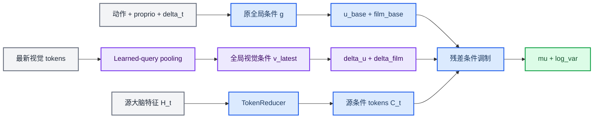

# 最新视觉全局条件设计

*适用分支：`async-cerebellum-per-step`；定义用可解释的全局视觉残差条件替换 `LatestVisualFusion`。*

---

## 📋 决策

当前 `LatestVisualFusion` 以压缩后的大脑特征 `C_t` 为 query，对最新视觉 tokens 做 cross-attention，并直接覆写 `C_t`。融合后的中间量没有明确的时间语义：它既不能严格表示源时刻状态，也没有直接监督保证其等于最新时刻状态。

新设计保持 `C_t` 不变。最新视觉通过独立的 learned-query attention pooling 压缩为全局向量 `v_latest`，再产生对原 FutureConditionHead 的两项残差条件：

```text
delta_u
delta_film
```

原始 WM 的动作、proprio、时间编码和 FutureConditionHead 参数保持不变。视觉残差输出层零初始化，使新模型初始化时严格退化为原始 Jetson-PI。

旧 token-level cross-attention 方案继续保存在 `visual-fusion-baseline` 分支，不在新分支中保留双路径开关。

## 🧭 数据流



原始条件路径：

```python
m = action_encoder(action_prefix, prefix_mask)
p = proprio_encoder(proprio)
e = time_encoder(delta_t)
g = concatenate([m, p, e])

u_base = u_proj(g)
film_base = film(g)
```

### 原始全局条件中各变量的具体含义

先明确各张量在这条路径中的位置。设批大小为 `B`，动作前缀长度为 `L`，动作维度为 `A`，压缩后的大脑 token 数为 `N`，未来纠正模块的 token 维度为 `D`：

| 变量 | 典型形状 | 表示的信息 | 是否包含视觉 token |
|---|---|---|---|
| `action_prefix` | `[B, L, A]` | 时间区间内需要纳入演化的动作序列 | 否 |
| `prefix_mask` | `[B, L]` | 动作序列中哪些位置有效 | 否 |
| `m` | `[B, H_action]` | 整段有效动作的摘要 | 否 |
| `proprio` | `[B, P]` | 调用该模块时传入的机器人本体状态 | 否 |
| `p` | `[B, H_proprio]` | 本体状态摘要 | 否 |
| `delta_t` | `[B]` | 从 `H_t` 的源时刻到目标时刻的时间或步数间隔 | 否 |
| `e` | `[B, H_time]` | 时间间隔摘要 | 否 |
| `g` | `[B, H_action + H_proprio + H_time]` | 动作、本体状态和时间组成的非视觉全局条件 | 否 |
| `C_t` | `[B, N, D]` | 由源时刻大脑特征 `H_t` 压缩得到的 token | 间接包含 `H_t` 中已有的旧视觉语义 |
| `u_base` | `[B, D]` | 施加到每个 `C_t` token 上的全局内容偏移 | 否 |
| `film_base` | `[B, 2D]` | 用于生成逐通道缩放与平移参数 | 否 |

#### `m`：整段动作的摘要

`action_prefix` 不是一个动作，而是一段动作序列。`prefix_mask` 用来区分真实动作和为了对齐批数据而补齐的无效位置。代码首先把每个动作从动作维度 `A` 投影到动作特征维度，然后将 mask 为假的位置清零，再由 GRU 或 Transformer 编码动作之间的时序关系。

当前两种动作编码器最终都会提取两类信息：有效序列最后一个位置的特征 `last_h`，以及所有有效位置的平均特征 `mean_h`。二者拼接后再投影，得到固定长度的 `m`：

```python
last_h = encoded_actions[last_valid_index]
mean_h = masked_mean(encoded_actions)
m = out_proj(concatenate([last_h, mean_h]))
```

因此，`m` 同时回答两个问题：这段动作整体做了什么，以及动作序列执行到末端时处于什么运动趋势。它不是模型新生成的动作，也不是某一个动作步的 embedding。

> 📌 **动作语义由调用侧决定：** `action_encoder` 本身不知道输入的是“已经执行的动作”还是“推理期间将继续执行的剩余动作”。它只编码 `action_prefix` 和 `prefix_mask`。具体语义必须由上游动作交接逻辑定义，并与训练阶段保持一致。

#### `p`：机器人当前物理状态的摘要

`proprio` 是调用未来纠正模块时显式传入的本体状态，例如机械臂关节位置、末端执行器状态和夹爪状态。它不由 `H_t` 生成，也不是大脑的输出。`ProprioEncoder` 使用两层 MLP 将原始状态投影成 `p`：

```python
p = fc2(swish(fc1(proprio)))
```

`p` 的作用是告诉演化模块：机器人现在实际处于什么姿态。即使两次观测具有相似的图像，如果机械臂关节角度或夹爪状态不同，未来特征也不应完全相同。这里“当前”具体对应哪个时刻，取决于调用 `_wm_forward` 时传入的是哪一帧 observation 的 `state`；编码器内部不会自动获取最新状态。

#### `e`：需要从源状态演化多远

`delta_t` 表示 `H_t` 所属源时刻与预测目标时刻之间的间隔。代码并非只把一个标量直接交给 MLP，而是先构造：

```python
raw_time = concatenate([
    delta_t,
    log1p(delta_t),
    delta_t ** 2,
    sincos_fourier(delta_t),
])
e = fc2(swish(fc1(raw_time)))
```

线性项保留基本步数关系，对数项增强较小间隔的分辨率，平方项表达随间隔增大的非线性变化，Fourier 特征为不同时间尺度提供周期基。最终的 `e` 告诉模块：这次不是只判断状态内容，还要判断从 `H_t` 出发需要跨越多长时间。

#### `g`：三类非视觉条件的汇总

`g = concatenate([m, p, e])` 只是把动作摘要、本体状态摘要和时间摘要沿最后一个维度拼接起来。它是每个样本一个向量，不带 token 轴，因此属于全局条件：同一个 `g` 会共同影响该样本中的所有 `C_t` token。

这一点很重要：`g` 不包含 `C_t`，也不包含最新视觉 token。`C_t` 负责表达“源状态是什么”，而 `g` 负责表达“在什么动作、物理状态和时间跨度条件下，从源状态向目标状态演化”。

#### `u_base`：给所有源 token 加入相同的内容偏移

`u_proj` 将 `g` 投影到 token 维度 `D`，得到 `[B, D]` 的 `u_base`。进入 FutureConditionHead 时，它会扩展成 `[B, 1, D]`，并广播到全部 `N` 个 `C_t` token：

```python
u_base = u_proj(g)[:, None, :]
shifted_tokens = C_t + u_base
```

所以 `u_base` 不是注意力查询，也不是 `mu`。它是一种共享的内容偏移：在保留每个 `C_t` token 原有差异的同时，依据动作、本体状态和时间条件，把所有 token 推向与当前演化目标相符的特征区域。

#### `film_base`：控制每个特征通道如何变化

`film(g)` 输出 `2D` 维向量，随后一分为二：

```python
film_base = film(g)
gamma, beta = split(film_base)
x = gamma[:, None, :] * shifted_tokens + beta[:, None, :]
```

`gamma` 决定每个特征通道被放大、缩小或改变符号，`beta` 再为每个通道提供条件相关的平移。它们同样沿 token 轴广播，但不同通道可以受到不同调制。FiLM 因而比单纯的 `C_t + u_base` 更灵活：`u_base` 主要改变内容位置，`gamma` 和 `beta` 进一步决定哪些通道应被强调、压制或重新偏置。

#### 从 `C_t` 到 `mu` 的完整关系

原始未来纠正头实际执行的是：

```python
shifted = C_t + u_base[:, None, :]
x = gamma[:, None, :] * shifted + beta[:, None, :]
x = block0(x)
x = block1(x)
mu = mean_head(x)
log_var = clip(logvar_head(x), log_var_min, log_var_max)
```

两个 `_FutureTokenBlock` 会在完成全局条件调制后，通过 self-attention 继续建模不同 token 之间的关系。`mean_head` 最终输出与 `C_t` 同形状的未来条件均值 `mu: [B, N, D]`；`logvar_head` 输出相同位置上的不确定性 `log_var`。因此，`mu` 仍然不是机器人动作，而是后续 Pi0 流匹配去噪使用的未来条件 token。

可以把整条原始路径概括为：`C_t` 提供源状态内容，`m` 提供动作变化，`p` 提供当前物理状态，`e` 提供演化距离；`u_base` 与 FiLM 将这三类全局条件施加到 `C_t`，最后才得到 `mu` 和 `log_var`。我们新增视觉条件时，不再提前改写 `C_t`，而是让最新视觉通过残差补充这两条全局调制路径。

新增视觉路径：

```python
v_latest = latest_visual_global_condition(
    latest_visual_tokens,
    latest_visual_mask,
)

delta_u = visual_u_proj(v_latest)
delta_film = visual_film_proj(v_latest)
```

最终调制：

```python
u = u_base + delta_u
film = film_base + delta_film
gamma, beta = split(film)

x = gamma[:, None, :] * (C_t + u[:, None, :]) + beta[:, None, :]
x = block0(x)
x = block1(x)

mu = mean_head(x)
log_var = logvar_head(x)
```

## ⚙️ 新增模块

新增 `LatestVisualGlobalCondition`，所有新参数放在统一路径：

```text
wm/latest_visual_global_condition/*
```

最小组成如下：

| 组件 | 作用 | 初始化 |
|---|---|---|
| `visual_kv_proj` | 将 SigLIP 维度投影到 `token_dim` | 常规初始化；同维时省略 |
| `visual_query` | 从视觉 tokens 中提取任务相关全局信息 | 小随机初始化 |
| `visual_attention` | learned query 对有效视觉 tokens 做 pooling | 常规初始化 |
| `visual_norm` | 归一化 pooled visual vector | 常规初始化 |
| `visual_u_proj` | 生成 `delta_u` | kernel 和 bias 全零 |
| `visual_film_proj` | 生成 `delta_film` | kernel 和 bias 全零 |

第一版不增加视觉 FFN、不增加第二套 FutureConditionHead，也不改变原有 `u_proj` 和 `film` 的输入维度。

### 缺失视觉的行为

以下两种情况必须返回全零视觉残差：

```text
latest_visual_tokens is None
latest_visual_mask 全为 False
```

因此无视觉输入时：

```text
u = u_base
film = film_base
```

模型行为与原始 Jetson-PI 一致。

## 💾 checkpoint 兼容性

当前 loader 先创建完整 ViT WM，再通过 `intersect_trees` 加载 checkpoint 中存在的参数。新设计利用该行为：

- 原始 WM checkpoint 完整恢复已有参数
- checkpoint 中没有的 `latest_visual_global_condition` 保留新模块初始化值
- 零初始化输出 adapter 保证加载后不会立即改变原模型输出
- 旧 `LatestVisualFusion` 的15000步参数不迁移到新模块

不扩展 `g` 的维度，因此无需修改或重排预训练 `future_head/u_proj` 与 `future_head/film` 权重。

## 🏋️ 训练范围

当前视觉专训阶段继续冻结 Pi0、SigLIP 和原 WM，只更新：

```text
wm/latest_visual_global_condition/*
```

训练数据与当前基线暂时保持一致：

```text
H_t 来源于 observation_t
最新视觉和 proprio 来源于 observation_f
action_prefix 覆盖 t 到 t+delta_t
监督目标为 reduce_tokens(H_f)
```

本次修改只解决视觉条件的结构和可解释性，不在同一个提交中引入过去动作/推理期间动作的三时刻训练。

## 🧪 测试要求

实施必须遵循测试先行，至少覆盖：

1. masked visual token 的数值变化不影响全局视觉条件
2. 全部视觉 mask 为假时，视觉残差严格为零
3. 视觉分支零初始化时，有视觉与无视觉的 `mu/log_var` 严格一致
4. 提供视觉时，返回的 `current_tokens` 仍严格等于 `reduce_tokens(H_t)`
5. 训练过滤器只选择 `wm/latest_visual_global_condition/*`
6. 原始 WM checkpoint 能加载，新视觉参数保留初始化值
7. 模型和策略日志使用 `LatestVisualGlobalCondition` 名称

训练后应增加诊断指标：

```text
norm(delta_u) / norm(u_base)
norm(delta_gamma) / norm(gamma_base)
norm(delta_beta) / norm(beta_base)
```

这些指标用于发现视觉残差是否压过原 Jetson-PI 条件，不作为本次最小实现的门控逻辑。

## 🚫 非目标

本次修改不实现：

- 大脑后台线程和 H/KV snapshot buffer
- 每步小脑推理调度
- 过去动作与推理期间动作的双 action encoder
- 动态动作块交接
- kappa 门控
- 新的三时刻训练数据
- 原视觉融合 checkpoint 的参数迁移

## ✅ 验收标准

- `C_t` 不再被最新视觉直接覆写
- 最新视觉只通过 `delta_u` 和 `delta_film` 影响 FutureConditionHead
- 新视觉输出层零初始化
- 无视觉或全 mask 时严格回退到原 WM
- 原 WM checkpoint 可继续加载
- 视觉专训仅更新新视觉全局条件模块
- 相关单元测试与原有模型测试全部通过
