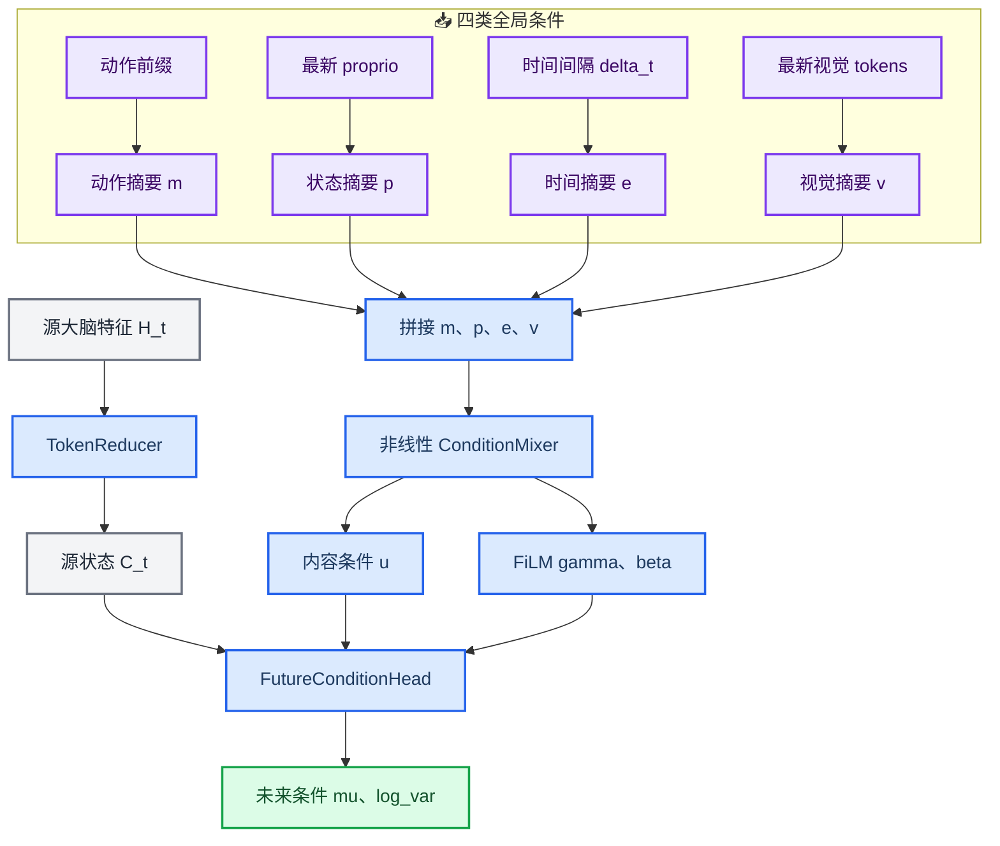

# 最新视觉联合条件演化模块设计

_适用分支：`async-cerebellum-per-step`；定义将最新视觉作为动作、本体状态和时间之外的第四类全局条件，并重新训练演化模块。_

---

## 📋 决策与版本关系

本设计不覆盖已有的 [最新视觉残差条件方案](./2026-08-20-latest-visual-global-condition-design.md)。两份文档分别代表两条可独立实现和比较的技术路线：

| 方案 | 视觉介入方式 | 训练范围 | 主要目的 |
| --- | --- | --- | --- |
| delta 方案 | `delta_u(v)`、`delta_film(v)` | 只训练视觉适配器 | 最大程度兼容原演化模块 |
| 本方案 | `g_joint = [m,p,e,v]` 后做非线性联合建模 | 分阶段训练完整演化模块 | 最大化最新视觉的表达能力 |

本方案选择第二条路线。最新视觉不再只是原 Jetson-PI 条件路径的独立残差，而是与动作、本体状态和时间一起决定未来特征如何演化。

仍然保留一个边界：最新视觉不在演化前直接覆写 `C_t`。`C_t` 继续表示由源时刻大脑特征 `H_t` 压缩得到的源状态，最新视觉通过全局条件路径影响从 `C_t` 到 `mu` 的演化。

## 🔍 方案比较

### 方案一：独立视觉残差

```python
u = u_base(g) + delta_u(v)
film = film_base(g) + delta_film(v)
```

优点是兼容旧 checkpoint、可以零初始化并只训练新增参数。缺点是视觉修正生成时没有直接看到动作、本体状态和时间。

### 方案二：线性拼接

```python
u = linear_u(concatenate([g, v]))
film = linear_film(concatenate([g, v]))
```

如果拼接后只有线性层，那么它与方案一在数学表达上等价。把线性层权重写成 `[W_g, W_v]` 后：

```text
W_g g + W_v v + b = u_base(g) + delta_u(v)
```

因此，单纯把代码从相加改成拼接不会增加模型表达能力。

### 方案三：非线性联合条件

```python
g_joint = concatenate([m, p, e, v])
z = condition_mixer(g_joint)
u = u_head(z)
film = film_head(z)
```

这是本设计采用的方案。非线性 `condition_mixer` 可以显式学习视觉与动作、本体状态、时间之间的联合关系。例如，同一幅图像在“夹爪正在闭合”和“夹爪正在张开”两种动作条件下，可以产生不同的未来特征演化。

## 🧭 模型架构



完整计算过程为：

```python
C_t = token_reducer(H_t)

m = action_encoder(action_prefix, prefix_mask)
p = proprio_encoder(proprio)
e = time_encoder(delta_t)
v = visual_encoder(latest_visual_tokens, latest_visual_mask)

g_joint = concatenate([m, p, e, v])
z = condition_mixer(g_joint)

u = u_head(z)
film = film_head(z)
gamma, beta = split(film)

x = gamma[:, None, :] * (C_t + u[:, None, :]) + beta[:, None, :]
x = block0(x)
x = block1(x)

mu = mean_head(x)
log_var = clip(logvar_head(x), log_var_min, log_var_max)
```

### 信息分工

| 变量 | 典型形状 | 语义 |
| --- | --- | --- |
| `H_t` | `[B, S, D_vlm]` | 源观测经过大脑后产生的隐藏特征 |
| `C_t` | `[B, N, D]` | 从 `H_t` 压缩得到的源状态 token |
| `m` | `[B, H_action]` | 动作前缀的末状态和整体运动摘要 |
| `p` | `[B, H_proprio]` | 调用演化模块时传入的机器人本体状态摘要 |
| `e` | `[B, H_time]` | 从源状态到预测目标的时间间隔摘要 |
| `v` | `[B, D]` | 从有效最新视觉 tokens 中提取的任务相关全局视觉摘要 |
| `g_joint` | `[B, G_joint]` | 四类条件的直接拼接结果 |
| `z` | `[B, D]` | 非线性联合建模后的共享条件表示 |
| `u` | `[B, D]` | 广播到全部 `C_t` token 的内容条件 |
| `film` | `[B, 2D]` | 生成逐通道 `gamma` 和 `beta` 的调制条件 |
| `mu` | `[B, N, D]` | 供 Pi0 流匹配去噪使用的未来条件 token |

`action_encoder` 只根据传入的数组和 mask 编码动作，不会自行判断动作属于“已经执行”还是“推理期间将执行”。该语义仍由上游训练样本和动作交接逻辑决定，并且二者必须一致。

## ⚙️ 新增与修改的模块

### VisualGlobalEncoder

输入接口：

```python
visual_encoder(
    latest_visual_tokens: Float[B, V, D_vlm],
    latest_visual_mask: Bool[B, V],
) -> Float[B, D]
```

第一版采用一个 learned query 对最新 SigLIP tokens 做 masked cross-attention pooling：

```python
visual_kv = visual_kv_proj(latest_visual_tokens)
query = broadcast(visual_query, batch_size=B)
v = visual_attention(query, visual_kv, latest_visual_mask)
v = visual_norm(v[:, 0, :])
```

该模块负责把多枚视觉 token 压缩成一个任务相关全局向量，不直接修改 `C_t`。

### JointConditionMixer

设：

```text
G_joint = H_action + H_proprio + H_time + D
```

第一版使用两层 MLP：

```python
g_norm = joint_norm(g_joint)
z = joint_fc1(g_norm)       # G_joint -> 2D
z = swish(z)
z = joint_fc2(z)            # 2D -> D
```

第一版不增加更深的残差 MLP、不增加 mixture-of-experts，也不增加视觉与 `C_t` 的第二条 token-level cross-attention 路径。

### JointFutureConditionHead

新 head 接收联合条件 `z`：

```python
u = u_head(z)               # D -> D
film = film_head(z)         # D -> 2D
```

随后继续沿用原有 FiLM、两个 `_FutureTokenBlock`、`mean_head` 和 `logvar_head`。旧的 `u_proj([m,p,e])` 与 `film([m,p,e])` 不再作为独立主路径存在。

## 🏋️ 训练设计

### 冻结范围

本方案继续冻结：

- Pi0 大脑及 Action Expert
- 共享 SigLIP 图像编码器
- 由 Pi0 产生的 `H_t` 和 `H_f`

演化模块内的参数允许重新训练，包括：

- `ActionEncoder`
- `ProprioEncoder`
- `TimeEncoder`
- `VisualGlobalEncoder`
- `JointConditionMixer`
- `JointFutureConditionHead`
- `_FutureTokenBlock`
- `mean_head` 与后续校准阶段的 `logvar_head`

`TokenReducer` 属于演化系统，但不能在条件预测损失中与监督目标同步自由变化。当前训练目标为：

```python
target = stop_gradient(token_reducer(H_f))
```

如果同一个 `TokenReducer` 一边生成 target、一边被该 target 监督更新，目标会随模型同步漂移，并存在退化表示风险。因此使用分阶段训练。

### 阶段一：稳定源与目标 token 空间

二选一：

1. 加载已经训练好的 `TokenReducer`
2. 使用现有 stage 1 动作损失先训练 `TokenReducer`，再冻结

阶段结束后，`C_t` 与目标 `C_f` 的 token 空间固定。

### 阶段二：训练联合演化均值

数据对保持当前时间对齐：

```text
H_t                    <- observation_t
latest_visual_tokens   <- observation_f
proprio                <- observation_f.state
action_prefix          <- t 到 t+delta_t 的动作序列
delta_t                <- f - t
target C_f             <- frozen TokenReducer(H_f)
```

阶段二冻结 `TokenReducer` 和 `logvar_head`，训练其余联合演化模块。损失可继续使用停止梯度的 `log_var` 计算异方差高斯 NLL，或者使用显式均值损失；第一版沿用当前停止梯度 `log_var` 的 NLL，减少训练代码分叉。

### 阶段三：校准不确定性

当 `mu` 已经能够稳定预测 `C_f` 后，再训练 `logvar_head`，防止模型在均值尚未学好时只依靠增大方差降低 NLL。

### 阶段四：可选动作损失联合微调

在条件预测稳定后，可以加入 Pi0 动作去噪损失，验证 `mu` 不仅接近 `C_f`，而且确实能够改善动作生成。该阶段不是第一版打通训练和评估的前置条件。

### 初始化策略

本设计不要求初始化时严格等价于原 Jetson-PI，也不要求所有新增输出为零。推荐采用部分 warm start：

- 加载形状匹配的 `TokenReducer`、动作/本体/时间编码器、FutureTokenBlocks、`mean_head` 和 `logvar_head`
- 随机初始化 `VisualGlobalEncoder`、`JointConditionMixer`、`u_head` 和 `film_head`
- 解冻设计规定的演化模块参数进行分阶段训练

同时允许完全随机初始化演化模块，但该模式需要单独实验，不与 warm-start 结果混在同一组对照中。

## 💾 checkpoint 与缺失视觉行为

新 checkpoint 必须保存完整演化模块，不再只保存视觉适配器。旧原始 WM 或 delta 视觉 checkpoint 只作为部分初始化来源，不保证严格加载为同一函数。

loader 应输出明确日志：

```text
loaded matching parameters
newly initialized parameters
shape-mismatched parameters
```

缺失视觉或 `latest_visual_mask` 全为假时：

```python
v = zeros([B, D])
```

模型必须保持数值有限并能够继续运行，但不要求输出严格等于原 Jetson-PI。因为 `JointConditionMixer` 和新的 head 已经重新训练，零视觉表示的是本模型内部的“无可用视觉条件”，而不是回退到旧模型。

## 🧪 测试与实验对照

### 单元测试

至少覆盖：

1. masked visual token 的数值变化不影响 `v`
2. 全部视觉 mask 为假时 `v` 为零且 `mu/log_var` 有限
3. `g_joint` 的维度严格等于四个条件维度之和
4. `condition_mixer` 的梯度能够到达 `m`、`p`、`e` 和 `v` 四个输入分支
5. 最新视觉不会改变返回的 `current_tokens = TokenReducer(H_t)`
6. 新 checkpoint 能保存和恢复完整演化模块
7. 训练过滤器不包含 Pi0 和 SigLIP 参数
8. 阶段二训练过滤器冻结 `TokenReducer` 与 `logvar_head`
9. 缺少 tokens 或 mask 其中之一时给出明确错误

### 公平对照实验

至少训练并评估以下四组：

| 组别 | 模型 | 视觉条件 |
| --- | --- | --- |
| A | 原始 Jetson-PI | 无新增视觉条件 |
| B | 新联合演化模块 | `v=0`，训练和评估均不提供视觉 |
| C | 新联合演化模块 | 使用与 `H_t` 同时刻的视觉 |
| D | 新联合演化模块 | 使用目标时刻或推理时最新视觉 |

对照含义：

- A 与 B：区分重新训练演化模块本身带来的变化
- B 与 C：验证联合视觉条件是否有用
- C 与 D：验证“更新的视觉”是否比“同一时刻的视觉”更有用

各组必须保持训练数据量、随机种子集合、动作地平线、`H/K` 设置和评估任务一致。记录：

```text
任务成功率
条件预测损失
动作去噪损失
kappa 或 log_var 统计
源图像与最新图像的时间差
视觉编码和演化模块延迟
```

## 🚫 非目标

本设计不同时实现：

- 大脑后台线程和 H/KV snapshot buffer
- 每步小脑推理调度
- 动态动作块补齐与交接
- 已执行动作和推理期间动作的双时间段编码
- kappa 门控大脑刷新
- 最新视觉直接修改 `C_t` 的 token-level cross-attention
- delta 方案 checkpoint 向联合条件网络的精确参数迁移

这些功能可以在联合条件演化模块完成训练和固定频率评估后分别设计。

## ✅ 验收标准

- 旧 delta 设计文档保持不变并可独立实现
- 最新视觉经 learned-query pooling 得到全局向量 `v`
- `m`、`p`、`e`、`v` 先拼接，再经过非线性 `JointConditionMixer`
- `C_t` 仍严格等于 `TokenReducer(H_t)`，不被最新视觉提前覆写
- 联合条件生成 `u`、`gamma` 和 `beta`，再预测 `mu/log_var`
- Pi0 与 SigLIP 在演化模块训练期间保持冻结
- `TokenReducer` 在条件预测阶段固定，避免监督目标同步漂移
- 完整演化模块 checkpoint 可以保存并用于评估
- 无视觉、同时刻视觉和最新视觉三类联合模型对照能够独立运行
- 相关单元测试、训练 smoke test 和单次异步评估均通过
